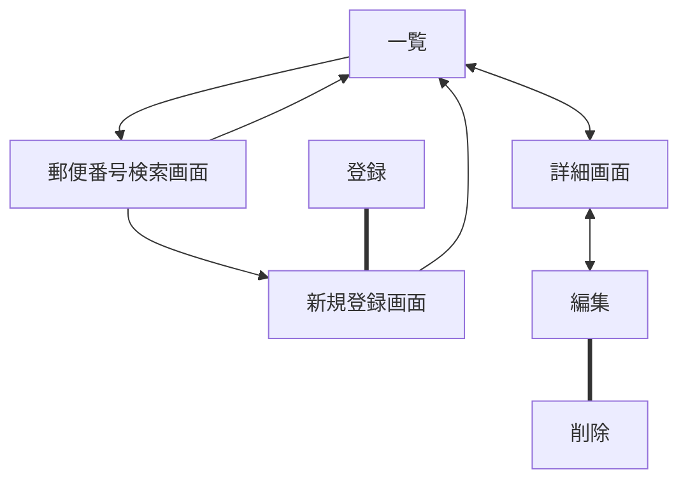

```mermaid
flowchart TB
  node_1["一覧"]
  node_2["郵便番号検索画面"]
  node_3["新規登録画面"]
  node_4["登録"]
  node_5["詳細画面"]
  node_6["編集"]
  node_7["削除"]
  node_1 --> node_2
  node_2 --> node_3
  node_2 --> node_1
  node_3 --> node_1
  node_4 ===  node_3
  node_1 <-->  node_5
  node_5 <-->  node_6
  node_6 === node_7

``` 

```mermaid

classDiagram
  direction TB

``` 